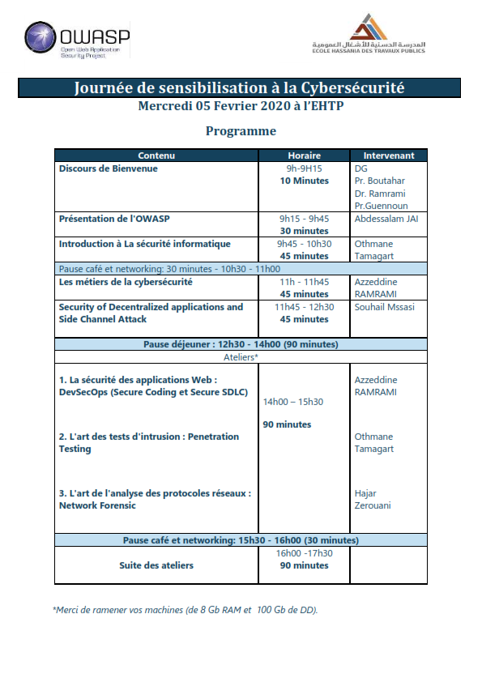

---

layout: col-sidebar
title: OWASP Morocco
tags: pastevents-tag participation-tag sponsorship-tag
level: 0

region: Africa

---
[Upcoming Events](#upcoming-events)   [Chapter Leadership](#chapter-leadership)

## Welcome

Our mission is to enrich Morocco's application security community and cyber security community. We
hope you can join us in accomplishing that.

## Upcoming Events

* OWASP Morocco Chapter Meeting February 5, 2020
* When: Wednesday, February 5th @ 08:00AM - 6:00PM
* Where:EHTP Casablanca/Morocco
* Title:OWASP Morocco Cyber Security dat at EHTP
* Have a look at our full program and join us\!

[back to top](#Welcome)

## Chapter Leadership

The chapter leadership board is as follows:

<table cellpadding="5" cellspacing="0" border="1">
  <tr><th>Chapter Leadership Board Member Role</th>
      <th width="50%">Responsibilities</th>
      <th>Person(s)</th></tr>
  <tr><td>Chapter Leader</td>
      <td>The central point of contact for the Chapter and responsible to the OWASP Board. Serves as Chapter Leader and Chapter board chair.</td>
      <td>Azzeddine RAMRAMI</td></tr>
    <tr><td>Sponsor Coordinator</td>
      <td>Serves as the primary liaison between the Chapter and all sponsors, and solicits sponsors for the Chapter meetings, happy hours, AppSec Africa, and other events.</td>
      <td>Azzeddine RAMRAMI Tarik EL OUADI Alaeddine MISBAHI </td></tr>
    <tr><td>Speaker Coordinator</td>
      <td>Seeks and schedules speakers for monthly Chapter meetings, AppSec Africa, and other events.</td>
      <td>Tarik EL OUADI</td></tr>
    <tr><td>Education Coordinator</td>
      <td>Coordinates all of the Chapter-sponsored educational offerings, to include the weekly Study Group and OWASP training.</td>
      <td>Azzeddine RAMRAMI Tarik EL OUADI Alaeddine MISBAHI </td></tr>
    <tr><td>PR/Marketing Coordinator</td>
      <td>Provides marketing of AppSec Africa and other Chapter events.</td>
      <td>To be added</td></tr>
    <tr><td>Membership and Project Coordinator</td>
      <td>Coordinates activities to grow individual and corporate memberships. Acts as project manager for events, such as AppSec Africa, tracking assigned tasks and reporting progress.</td>
      <td>Azzeddine RAMRAMI & Tarik EL OUADI</td></tr>
    <tr><td>Events Committee</td>
      <td>All of the Chapter Leadership Coordinators are responsible for coordinating aspects of events, including the annual Morocco Application Security Conference (AppSec Africa). The Chapter Leader acts as the committee chair.</td>
      <td>Chapter Leadership Coordinators</td></tr>
    <tr><td>Finance</td>
      <td>The Chapter Leader is designated as primary person responsible for Chapter budget and Chapter expense approvals.
The previous Chapter Leader is designated as secondary approver, who also will approve any expenses submitted by the Chapter Leader.</td>
      <td>Azzeddine RAMRAMI - Primary Tarik EL OUADI - Secondary</td></tr>
    <tr><td>Advisory Board Members</td>
      <td>Made up of previous Chapter leaders who provide mentoring, coaching, and assistance to the board and contribute to the Chapter’s success.</td>
      <td>Azzeddine RAMRAMI Tarik EL OUADI Alaeddine MISBAHI </td></tr>
</table>
  
[back to top](#Welcome)

